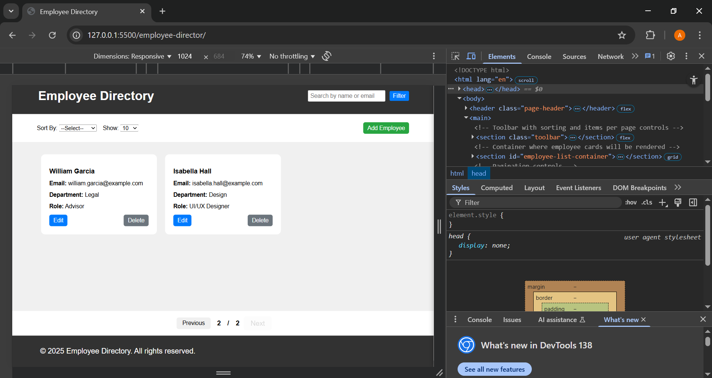
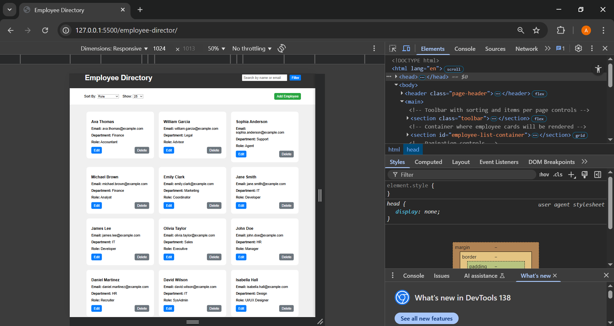
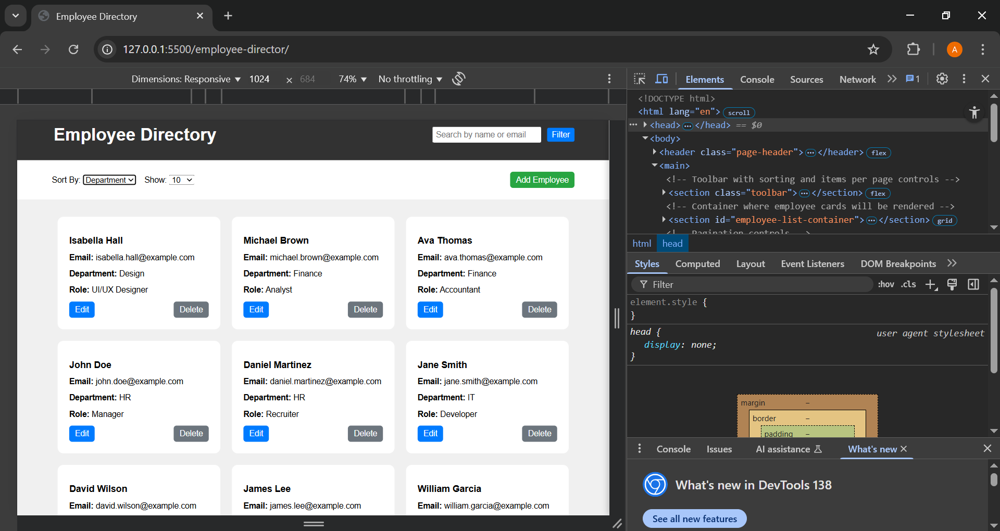
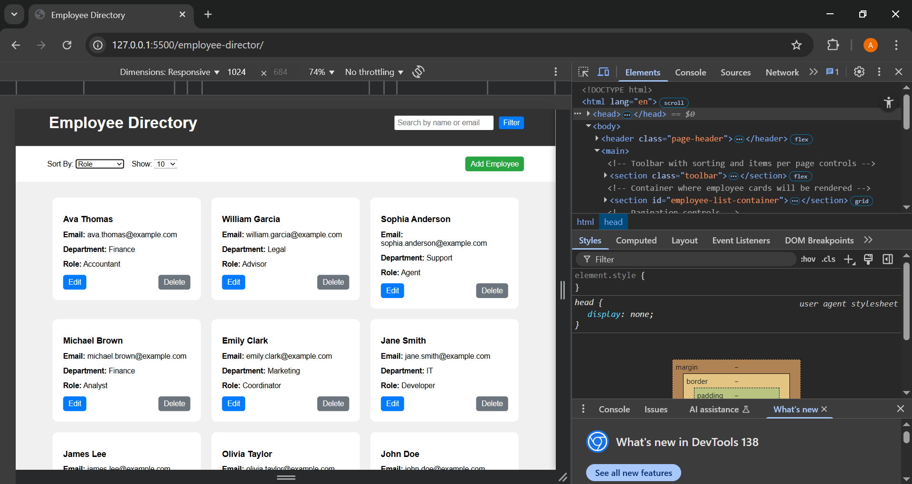
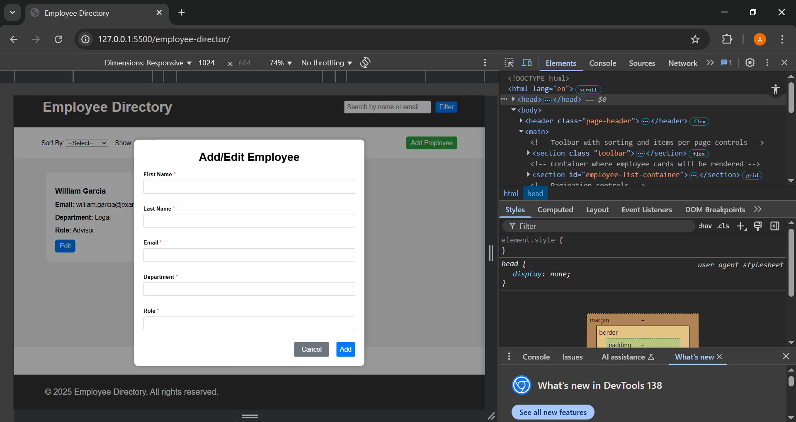
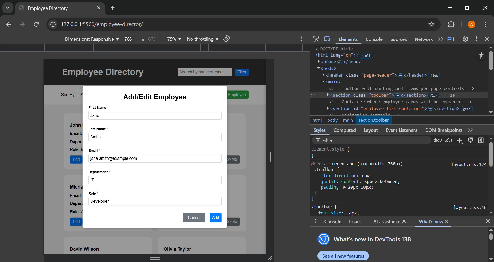
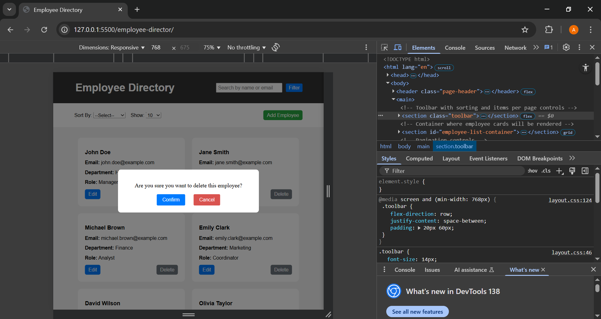

# 🧑‍💼 Employee Directory Web Interface

---

## 🚀 Project Overview

Welcome to the **Employee Directory** — a responsive, user-friendly web app to **view**, **add**, **edit**, and **delete** employees. It supports **searching**, **filtering**, **sorting**, and **pagination** to manage employee data efficiently.

Built with **HTML**, **CSS**, and **Vanilla JavaScript**, using a mock data array stored in `data.js` to simulate employee data without a backend. This project demonstrates front-end development skills with clean, modular code and responsive design.

---

## 📂 Project Structure

```bash
employee-directory/
├── src/
│   └── static/
│       ├── css/
│       │   ├── base.css         # Base styles and resets
│       │   ├── components.css   # UI components styling (buttons, cards, forms)
│       │   └── layout.css       # Layout & responsive design styles
│       └── js/
│           ├── app.js           # Core app logic & DOM manipulation
│           ├── data.js          # Mock employee data
│           ├── employeeServices.js # CRUD operations & data handling
│           └── form.js          # Form display, validation & submission logic
└── index.html  # Main page of the application
```

---

## ⚙️ Setup & Running Instructions

This project is a simple frontend application built with HTML, CSS, and JavaScript. No backend or server setup is required.

### How to run:

- **Option 1:**  
  Open the `index.html` file directly in any modern web browser (Chrome, Firefox, Edge).

  > ⚠️ **Important:** Because this project uses ES6 `import` / `export` modules, opening the file directly using `file:///` URLs **may cause the app to break or modules not load properly** due to browser security restrictions.

- **Option 2 (Recommended):**  
  Use [VS Code Live Server extension](https://marketplace.visualstudio.com/items?itemName=ritwickdey.LiveServer) by **Ritwick Dey** to serve the files locally with live reload support.  
  Steps:
  1. Open the project folder in VS Code.
  2. Right-click on `index.html`.
  3. Select **"Open with Live Server"**.

> ⚠️ **Note:** Always use the official Live Server extension by Ritwick Dey for stability and security. Avoid unverified or risky extensions.  
> Serving files over a local server allows ES6 modules to work correctly.

---

## 🌐 Live Demo

You can see the live deployed version of the app here:  
[https://ajackus-employee-directory-web-inte.vercel.app/](https://ajackus-employee-directory-web-inte.vercel.app/)

---

# ✨ Features

- 🔍 **Display employees** in a clean card/grid layout
- ➕ **Add** new employees with client-side validation
- ✏️ **Edit** existing employee details
- ❌ **Delete** employees with confirmation dialog
- 🔎 **Search** by name or email
- 🎛️ **Filter** by first name, department, and role
- ↕️ **Sort** by department and role
- 📄 **Pagination** for better data navigation
- 📱 Fully **responsive** design following a **mobile-first** approach for smooth experience on all devices

---

# 📸 Screenshots

> _Below are some key views and functionalities demonstrated in the app:_

### 🖥️ Desktop / Laptop Views

- **Dashboard on Laptop (1024px)**

  _GoogleChrome.png>)

- **Pagination Display**

  

- **Show 25 Items Dropdown**

  

- **Sort by Department**

  

- **Sort by Role**

  

---

### 📱 Mobile Views (320px)

- **Mobile View**

  _GoogleChrome.png>)

- **Mobile Navbar View**

  _GoogleChrome.png>)

---

### 📱 Tablet View (768px)

- **Tablet Responsive Layout**

  _GoogleChrome.png>)

---

### ✏️ Add / Edit / Delete Views

- **Add Employee Form**

  

- **Edit Employee Form**

  

- **Delete Confirmation Popup**

  

## 🛠️ Technologies Used

- HTML5
- CSS3 (BEM methodology, Flexbox & Grid)
- Vanilla JavaScript (ES6+)
- Freemarker Templates (for initial server-side rendering simulation)

---

## 🤔 Challenges & Learnings

- Managing combined **filtering**, **searching**, and **sorting** using clean, modular JavaScript
- Structuring and maintaining **clean project organization** across multiple JS modules (e.g., `app.js`, `form.js`, `employeeServices.js`)
- Handling **ES6 module imports/exports** in the browser by using a local server (Live Server)

## 🔮 Future Improvements

- 🌐 Backend API integration for persistent data storage (e.g., Node.js/Express, Spring Boot)
- 🔐 User authentication & role-based access control
- 🎨 Enhanced UI animations and transitions for smoother user experience
- 🔍 Advanced filtering options with multi-select, date ranges, and more
- ♾️ Infinite scroll instead of pagination for seamless data loading
- 🧪 Unit & integration tests for frontend modules to improve stability and maintainability

---

## 📫 Contact

Feel free to reach out if you have questions or suggestions!

**Amarnath Racha**  
**Email:** [amarnath201099@gmail.com](mailto:amarnath201099@gmail.com)

Thanks for checking out the project! 🎉
